# WiseFlow - Effortless Cashflow Tracking, Enhanced Financial Management

## Description

Welcome to my precisely crafted personal project, representing the culmination of over a year's worth of dedicated learning and practical experience in the field of web development. This project serves a dual purpose: firstly, as the centerpiece for my thesis/project defense in the Angular - June 2023 course, where I aim to showcase the depth of my knowledge and technical expertise in this framework. Secondly, it holds a special place in my personal portfolio, which aims to demonstrate my growth and proficiency as a skilled web developer. Beyond the Angular - June 2023 course exam, I am devoted to refining and enhancing this financial tool based on feedback, industry trends, and new technologies. As I grow as a developer, so will this project, as it will be regularly updated to ensure it remains relevant and usefull in the ever-evolving landscape of web development.

This is a full-stack financial tool designed to help users manage their finances efficiently. The application allows users to track their cashflow effortlessly and provides various features to enhance financial management.

## Live Demo (Limited for Education Purposes)

Please note that the live demo of this project is provided for educational purposes and is subject to certain limitations due to the free services it is hosted on. The demo is deployed using free services from Netlify, Render and Atlas, which may result in slower response times and occasional instability. Additionaly, keep in mind that the live demo might receive updates at a slower pace compared to the version you can run locally.

For a more optimal experience with faster response times and stability, I do recommend running the project locally on your machine.

**Live Demo Link:** [Visit Live Demo](https://main--wise-flow.netlify.app)

Keep in mind that if you encounter any issues with the live demo, such as slower loading times or occasional errors, it is not reflective of the project's performance when run locally. Feel free to clone and set up the project on your machine to experience its full potential.

## Project Technologies and Dependencies

This project was built using the following technologies and dependencies:

### Client-side:
- TypeScript
- Angular
- Tailwind CSS
- JavaScript
- HTML & CSS
### Server-side:
- Express - Node.js web application framework
- Mongoose - a connection between MongoDB and the Node.js
- JSON Web Token
- Bcrypt - a password-hashing function
- Axios - Promise based HTTP client for the browser and node.js

## Features

- **Add Flows:** Registered users can record their regular/one-time incomes and expenses, enabling them to dynamically keep track of their balance.

- **Profile:** Registered users have access to a detailed view of all the entries they have made since using the app. This includes dates, descriptions, and amounts of income/expense. Users can also delete specific entries.

- **Currency Converter:** Registered users can convert amounts of money to various world currencies in real-time, using the most recent exchange rates.

- **Percentage Calculator:** Registered users can perform three different percentage calculations and view their three most recent results.

- **TVM Calculator:** Users can calculate various financial values based on known inputs using the Time Value of Money (TVM) calculator.

## Progress Saving

The app is ensuring that users can always pick up from where they left off. When users log out, their progress is saved securely on the server. Upon returning to the app and logging back in, users can seamlessly resume their work without losing any data.

## Security Updates

The project includes the following security enhancements:

- Guards: Different features are protected with guards to restrict access based on user authentication status.

- JWT Blacklist: A blacklist system stores every used JSON Web Token (JWT) after a user logs out, ensuring better security.

- 404 Page: A custom 404 page is implemented to handle undefined routes.

## Installation

To run the project locally, follow these steps:

1. Clone the repository to your local machine.
2. Navigate to the project's root directory in your terminal.
3. Install the dependencies of both client and server side, using the package manager of your choice:
4. Open your browser and go to `http://localhost:4200/` to access the application.

## License

[MIT License](https://github.com/AlekSkyHigh/wise-flow/blob/master/LICENSE)

## Contact

If you have any questions or inquiries, feel free to reach out to me at aleksandar.voynov.info@gmail.com

Happy budgeting and financial management!

## Desktop View Images

- Snapshot of the Home Page for Non-Registered Visitors

- Snapshot of the Login Page for Non-Registered Visitors

- Snapshot of the Register Page for Non-Registered Visitors

- Snapshot of the About Us Page for Non-Registered Visitors
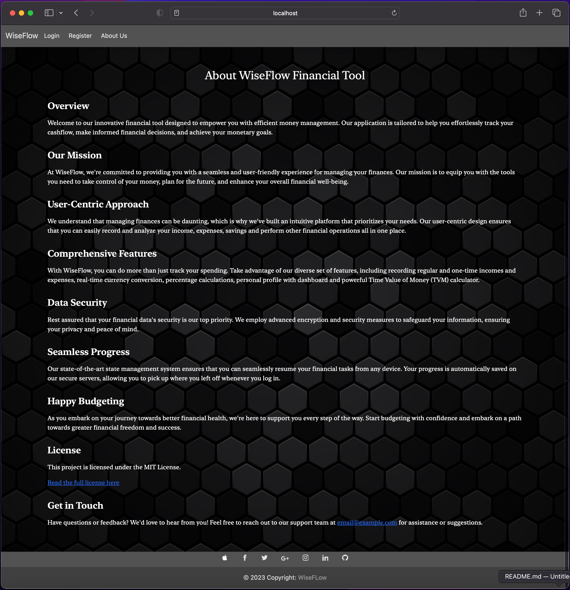

- Snapshot of the Home Page for Registered Visitors
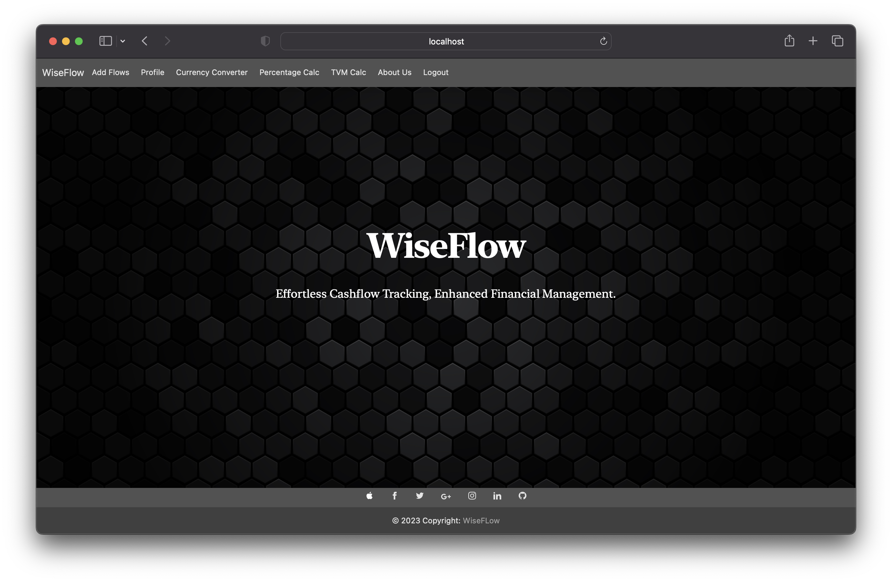

- Snapshot of the Add Flows Page for Registered Visitors
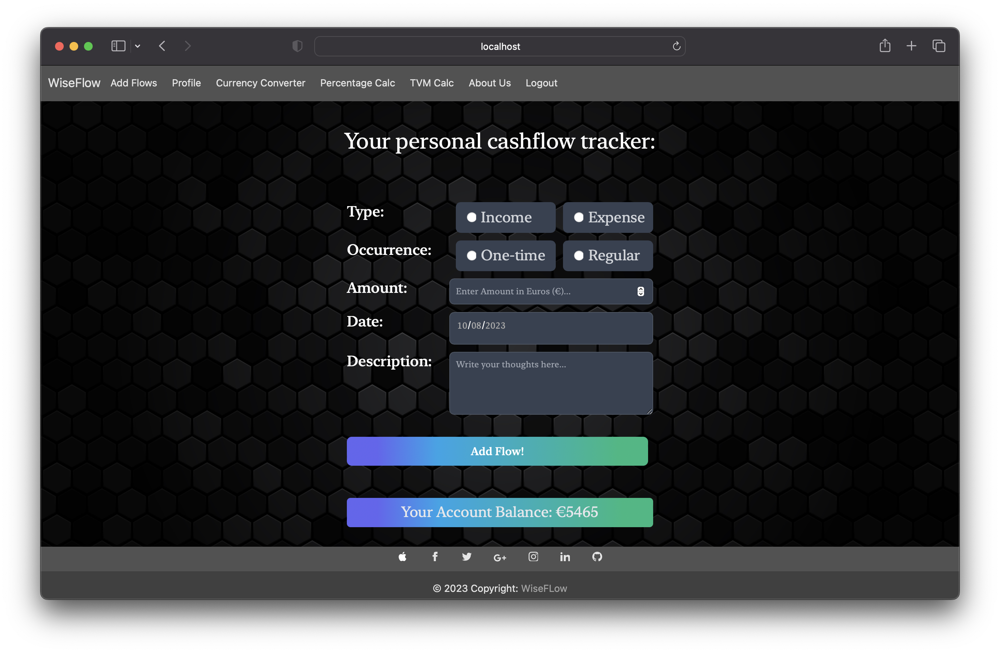

- Snapshot of the Profile Page for Registered Visitors
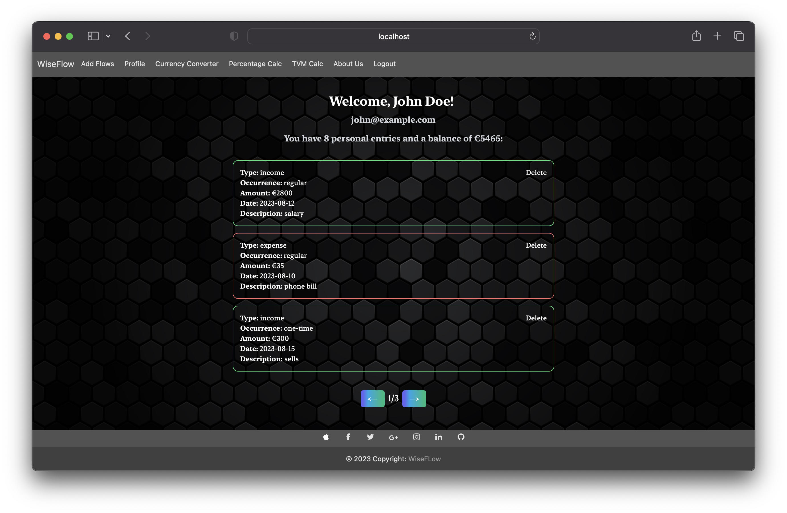

- Snapshot of the Currency Converter Page for Registered Visitors
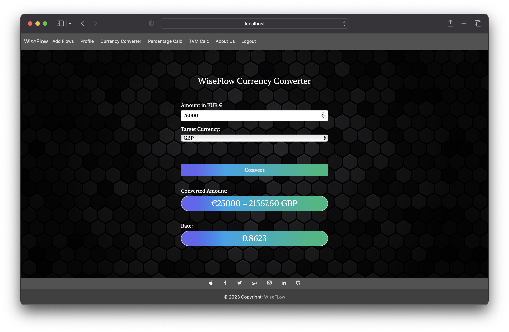

- Snapshot of the Percentage Calculator Page for Registered Visitors
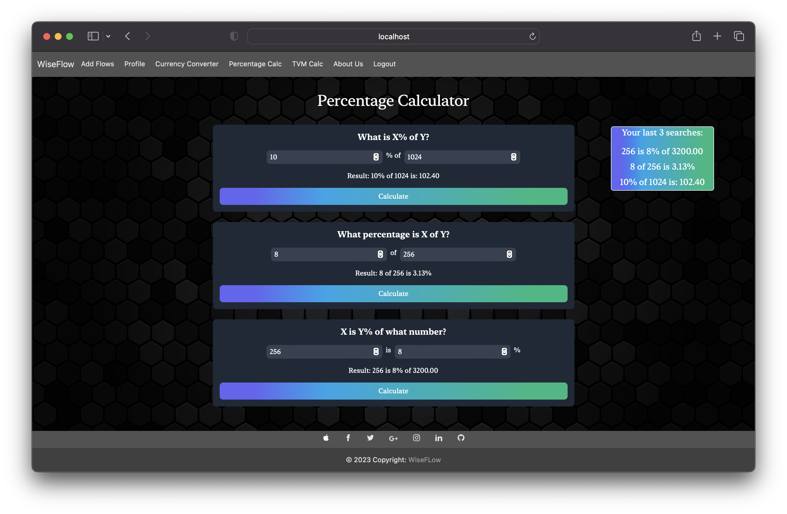

- Snapshot of the TVM Calculator Page for Registered Visitors
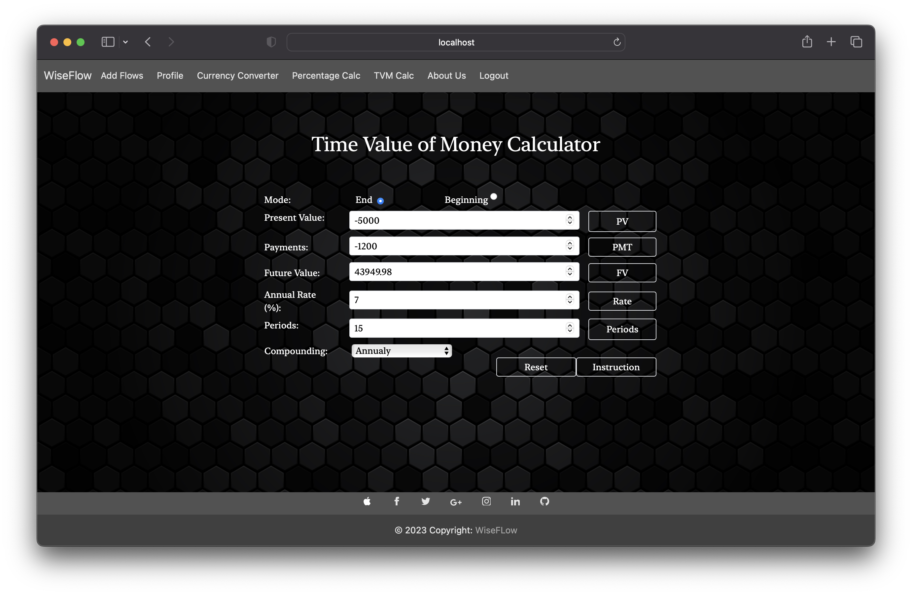

## Mobile View Images

- Snapshot of the Home Page

- Snapshot of the Login Page for Non-Registered Visitors
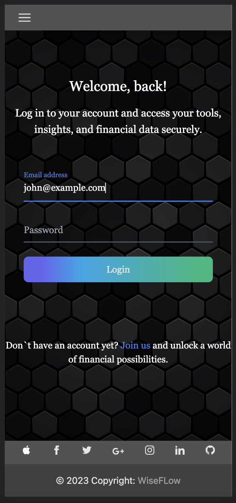

- Snapshot of the Register Page for Non-Registered Visitors

- Snapshot of the Add Flows Page for Registered Visitors
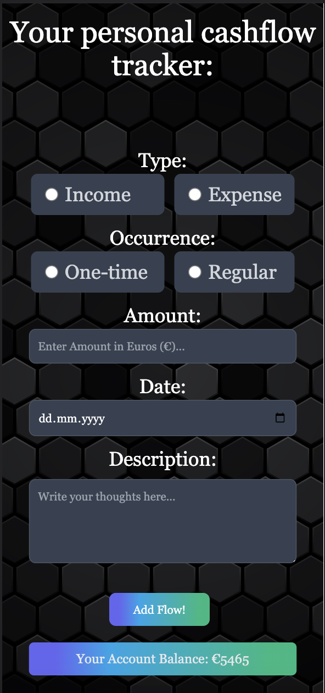

- Snapshot of the Profile Page for Registered Visitors
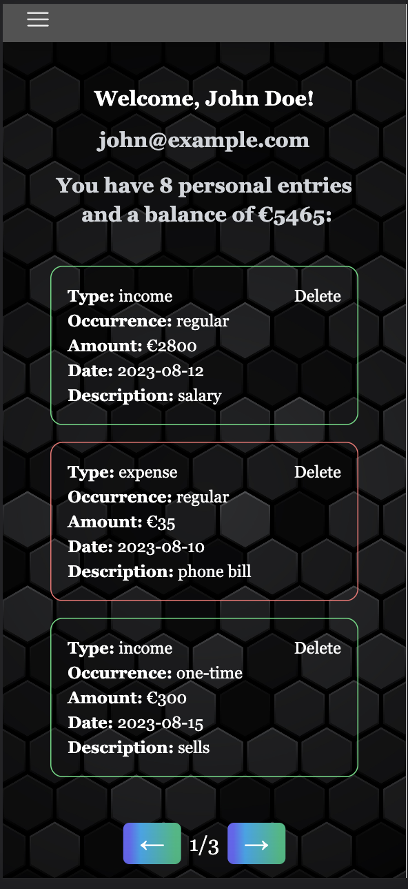

- Snapshot of the Currency Converter Page for Registered Visitors
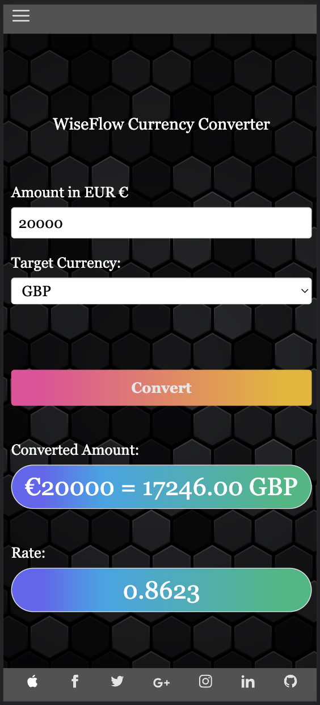

- Snapshot of the Percentage Calculator Page for Registered Visitors
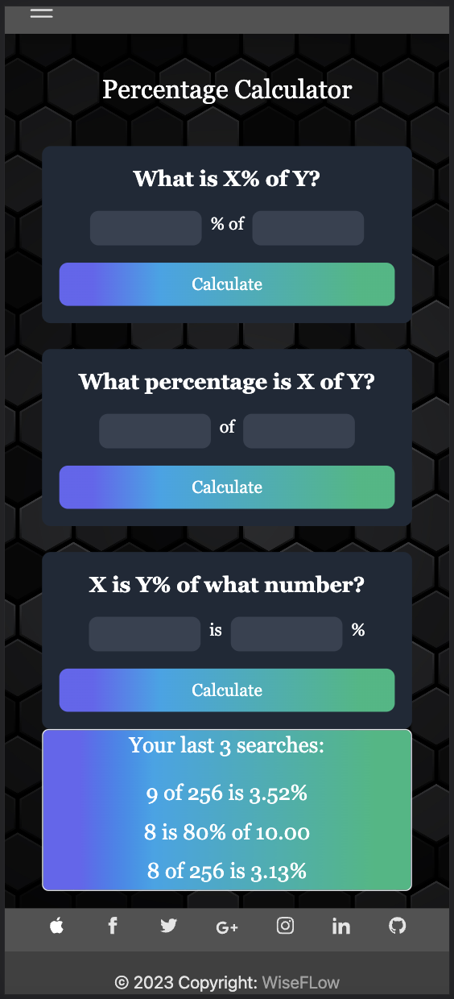

- Snapshot of the TVM Calculator Page for Registered Visitors
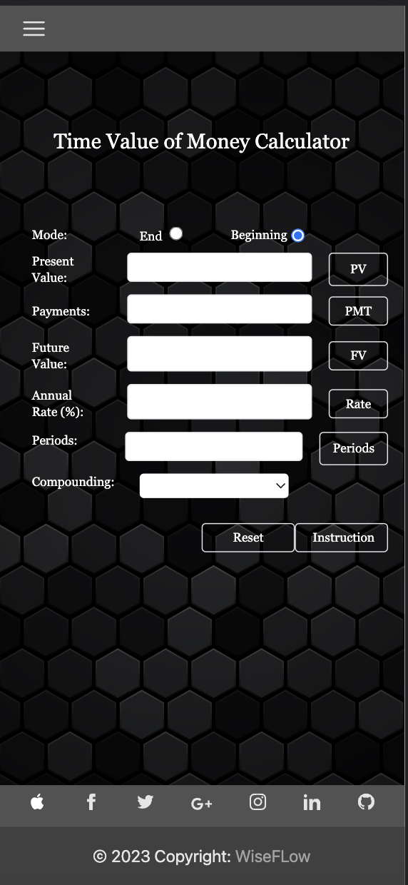
